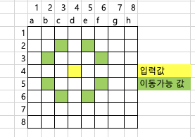

# 3/21
[ppt_그리드_52/69]
* 시간 문제


* 왕실의 나이트 문제 [ppt_그리드_57/69] 
* 나이트는 특정한 위치에서 다음과 같은 2가지 경우로 이동할 수 있다. = 장기에서 [말]과 동일
  1. 수평으로 두칸 이동한 뒤에 수직으로 한 칸 이동하기
  2. 수직으로 두칸 이동한 뒤에 수평으로 한 칸 이동하기

* 입력: d4
* 출력: 8

* 입력: a1
* 출력: 2

```python
# 현재 나이트의 위치 입력받기
input_data = input() # 1열 1행: a1, 2열 3행: b3
row = int(input_data[1])
col = (ord(input_data[0]) - ord('a')) +1
# 나이트가 이동할 수 있는 L자형 8가지 방향 정의
steps = [(-2,-1), (-1,-2), (1,-2), (2,-1), (2,1),(1,2), (-1,2), (-2,1)]
# 8가지 방향에 대해 각각 그 위치로 이동이 가능한지를 체크하자
count = 0
for step in steps:
    # 첫번째 루프 : step =(-2, -1)
    # 2번째 루프 : step =(-1, -2)
    # ..
    # 8번째 루프 : step =(-2, 1)
    next_row = row + step[0]
    next_col = col + step[1]
    # next_rowrk 1~8 사이이고 next_col이 1~8 사이이면 count를 1 증가 시키면 된다.
    if 1<= next_row <=8 and 1<= next_col <= 8 :
    # if 1<= next_row && next_row <=8 &&  1<= next_col && next_col <= 8 :
        count += 1

print(count)
```
