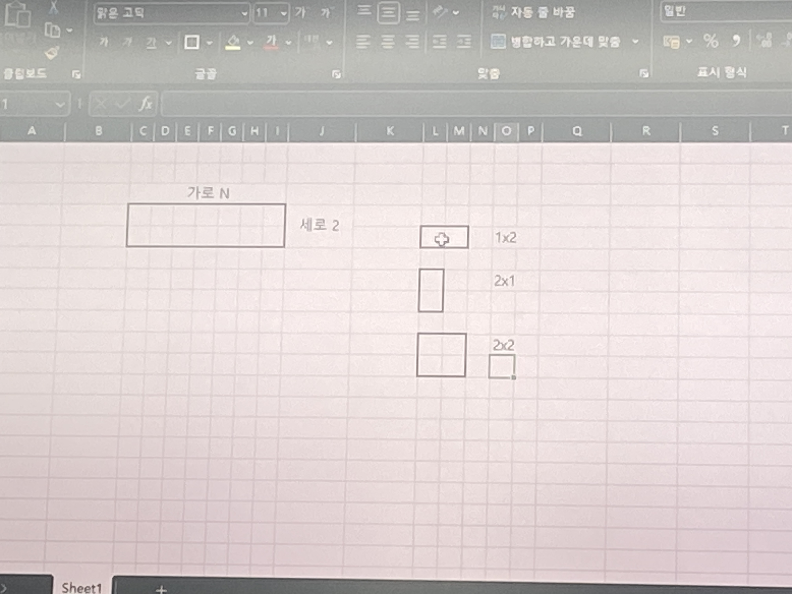
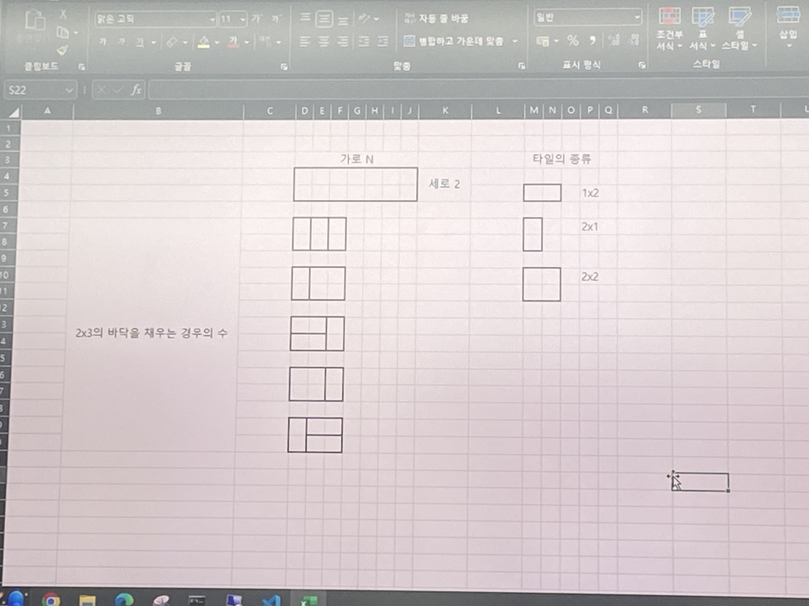

# 바닥공사
* 가로의 길이가 N, 세로의 길이가 2인 직사각형 형태의 얇은 바닥이 있다.
* 이 얇은 바닥을 (가로 * 세로) (1 * 2), (2 * 1), (2 * 2) 덮개를 이용해 채우고자 한다.
* 이 때 바닥을 채우는 모든 경우의 수를 구하는 프로그램을 작성하시오.
  - 예를 들어 (2 * 3) 크기의 바닥을 채우는 경우의 수는 5가지이다.
    * 입력 조건
      - 첫 줄에 N이 주어진다. 1<= N <= 100
    * 출력 조건
      - 첫째 줄에 (2 * N) 크기의 바닥을 채우는 방법의 수를 796, 796으로 나눈 나머지를 출력한다.

    * 입력 예시
      3
    * 출력 예시
      5

* 바닥공사 예시 
1. 2*1 3개
2. 1*2 2개, 2*2 1개
3. 1*2 2개, 2*1 1개
4. 2*2 1개, 2*1 1개
5. 2*1 1개, 1*2 2개

=> N이 1일 때 바닥을 채우는 경우의 수는: memo[1] = 1
=> N이 2일 때 바닥을 채우는 경우의 수는: memo[2] = 3

=> N이 3일 때 바닥을 채우는 경우의 수는: memo[2] = 3
  - 두가지의 경우
    1. N-1번째까지 바닥을 채웠다고 가정
      - N-1까지 바닥을 채우는 경우의 수는 memo[N-1]이고, 나머지 N번째 바닥을 채우는 경우의 수도 달라지지 않는다.
    2. N-2번째까지 바닥을 채웠다고 가정
      - N-2까지 바닥을 채우는 경우의 수는 memo[N-2]이고, 나머지 바닥을 채우는 경우의 수는
    => 이걸 정리를 하면
      memo[N] = memo[N-1] + memo[N-2]*2
