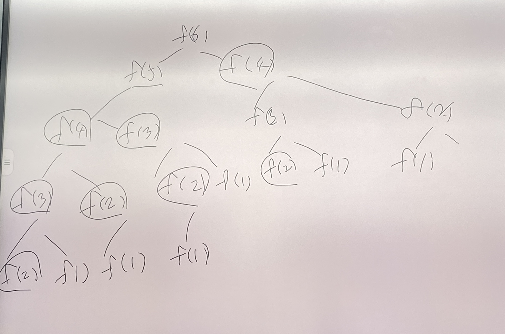

# 다이나믹 프로그래밍 - dynimaic_programming
* 관건: 문제를 분석 -> 문제 해결을 위한 다항식(= 점화식)을 세우기
* 식을 세우면 프로그래밍은 간단한 편
* 다항식 (= 점화식): 한글과 가능한 인접하게 식을 표현하는 기법

* 사용 가능 조건!
1. 큰 문제를 작은 문제로 나눌 수 있다.
2. 작은 문제에서 구한 정답은 그것을 포함하는 큰 문제에서도 동일하다.
* 피보나치 수열은 위의 조건을 만족하는 대표적인 문제이다
* 이 문제를 메모이제이션(Memoization) 기법을 사용하여 해결해보자

## 피보나치 수열
* f(n) = f(n-1) + f(n-2) // n>=1
* 단!! 
  f(1) = 1
  f(2) = 1
  f(3) = f(2) + f(1) = 1 + 1 = 2
  f(4) = f(3) + f(2) = 2 + 1 = 3

```python
# 피보나치 함수를 재귀함수로 구현
def fibo(n) :
  if n == 1 or n ==2 :
    return 1
  return fibo(n-1) + fibo(n-2)

print(fibo(6))
```
//
f(5) = f(4) + f(3)
f(4) = f(3) + f(2)
f(3) = f(2) + f(1)
f(2) = 1, f(1) = 1, f(3) = 2, f(4) = 3, f(5) = 3+2 = 5

f(6) = f(5) + f(4) = 5 + 3 = 8
//

## 메모이제이션 (= 캐싱_caching)
* 다이나믹 프로그래밍을 구현하는 방법 중 한 종류로, 한 번 구한 결과를 메모리 공간에 메모해두고 같은 식을 다시 호출하면 메모한 결과를 기져오는 기법을 의미!
* 값을 저장하는 방법이므로, 캐싱(caching)이라고도 한다
* 다이나믹 프로그래밍이란 큰 문제를 작게 나누고, 같은 문제라면, 한 번씩만 풀어 문제를 효율적으로 해결하는 알고리즘 기법이다.
* 다이나믹 프로그래밍과 분활 정복의 차이점 
  - 다이나믹 프로그래밍: 문제들이 서로 영향을 미치고 있음.
```python
# 구하고자 하는 피보나치 수열의 최대값은 100이라고 가정
memo = [0] * 101 # 이미 구현한 피보나치 수열의 값을 저장할 리스트를 0으로 초기화

# 피보나치 함수를 재귀함수로 구현
def fibo(n) :
  if n == 1 or n ==2 :
    return 1
  # fibo(n)의 값이 이미 구해져 있는지 검사하고, 이미 있다면 계산없이 그 값을 반환
  if memo[n] != 0 # 메모해둔 피보나치 수열 n의 값이 이미 존재하면 계산하지 않고, 그 값을 반환하자.
    return memo[n]
  # 실행 흐름이 여기까지 온다는 것은 기억해둔 값이 없다는 것이니, 계산을 하자
  memo[n] = fibo(n-1) + fibo(n-2)

  return memo[n]

# fibo(7) = fibo(6) + fibo(5) = 8 + 5 , memo[7] = 13
# fibo(6) = fibo(5) + fibo(4) = 5 + 3 , memo[6] = 8
# fibo(5) = fibo(4) + fibo(3) = 3 + 2 , memo[5] = 5
# fibo(4) = fibo(3) + fibo(2) = 2 + 1 , memo[4] = 3
# fibo(3) = fibo(2) + fibo(1) = 1 + 1 , memo[3] = 2
# fibo(2) = 1
# fibo(1) = 1
```
## top Down(하향식 풀이) => 재귀 함수를 이용해 구현
* 큰 문제에서 작은 문제로

fibo(6) = fibo(5) + fibo(4)
fibo(5) = fibo(4) + fibo(3)
fibo(4) = fibo(3) + fibo(2)
fibo(3) = fibo(2) + fibo(1)


## bottom up(상향식 풀이) => 반복문을 이용해 구현 (이 방법이 더 효율적)
* 작은 문제에서 큰 문제로

f(1), f(2) => f(3)
f(2), f(3) => f(4)
f(3), f(4) => f(5)
f(4), f(5) => f(6)

```python
## bottom up 방식

# 구하고자 하는 피보나치 수열의 최대값은 100이라고 가정
memo = [0] * 101 # 이미 구현한 피보나치 수열의 값을 저장할 리스트를 0으로 초기화

memo[1] = 1 # 피보나치 수열 1
memo[2] = 1 # 피보나치 수열 2
# 피보나치 함수를 재귀함수로 구현
# fibo(n)을 구하려면 fibo(1), fibo(2), fibo(3), ..., fibo(n-1) 을 구해야함
def fibo_bottom_up(n) :
  for i in range(3, n-1) : # range(start, end)에서 start는 포함, end는 미포함,
    memo[i] = memo[i-1] + memo[i-2]

fibo_bottom_up(10)
print(memo[10])
```

## 다이나믹 동적 할당
* 프로그램 실행 중 메모리를 할당해 사용
* 여기서의 다이나믹과는 의미가 다름!

## 계산 복잡도
