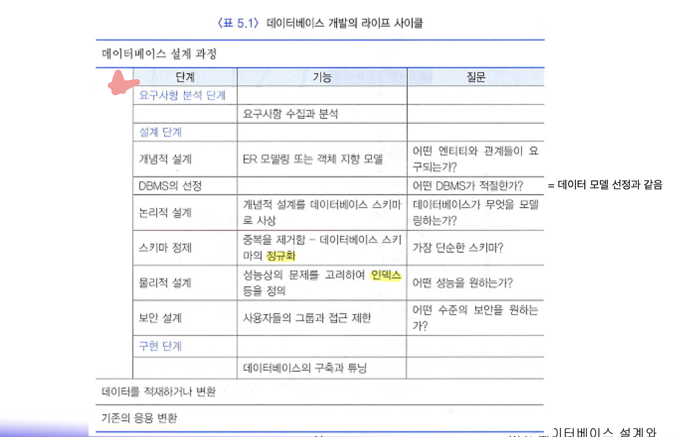
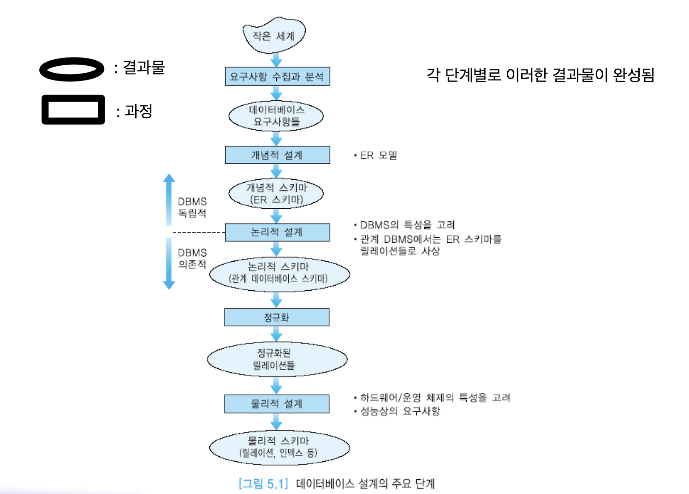
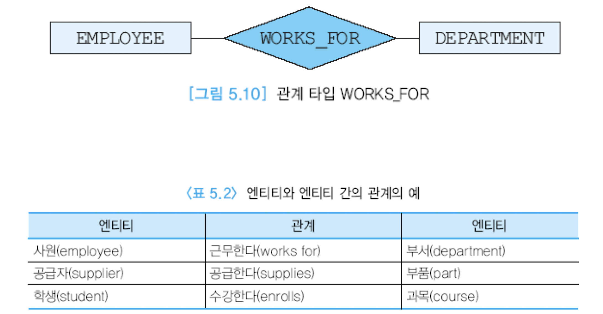

# 데이터베이스 설계와 ER모델
* 데이터베이스 설계
  - 개념적 데이터베이스 설계와 물리적 데이터베이스 설계로 구분
  - 개념적 데이터베이스 설계는 실제로 데이터베이스를 어떻게 구현할 것 인가와는 독립적으로 정보 사용의 모델을 개발하는 과정
  - 물리적 데이터베이스 설계에서는 물리적인 저장 장치와 접근 방식을 다룸
  - 개념적 데이터베이스 설계 과정에서 조직체(실세계)의 엔티티, 관계, 프로세스, 무결성 제약조건 등을 나타내는 추상화 모델을 구축
  - 엔티티는 서로 구분이 되면서 조직체에서 데이터베이스에 나타내려는 객체(사람, 장소, 사물 등)를 의미
  - 관계는 두 개 이상의 엔티티들 간의 연관을 나타냄
  - 프로세스는 관련된 활동을 나타냄
  - 무결성 제약조건은 데이터의 정확성과 비즈니스 규칙을 의미

* 개념적 수준의 모델
  - 특정 데이터 모델과 독립적으로 응용 세계를 모델링 할 수 있도록 함
  - 데이터베이스 구조나 스키마를 하향식으로 개발할 수 있기 위한 틀(framework)을 제공함
  - 인기 있는 개념적 수준의 모델은 엔티티-관계(ER: Entity-Relationship) 모델
  - ER 모델과 같은 개념적인 데이터 모델이 사상될 수 있는 다수의 구현 데이터 모델(implementation data model)이 존재함
  - 구현 단계에서 사용되는 세 가지 데이터 모델: 관계 데이터 모델, 계층 데이터 모델, 네트워크 데이터 모델

## 데이터베이스 설계의 개요
* 데이터베이스 설계의 개요
  - 한 조직체의 운영과 목적을 지원하기 위해 데이터베이스를 생성하는 과정
  - 목적은 모든 주요 응용과 사용자들이 요구하는 데이터, 데이터 간의 관계를 표현하는 것
  - 데이터베이스 개발은 일반적인 프로젝트 라이프 사이클 과정을 따름
  - 훌륭한 데이터베이스 설계는 시간의 흐름에 따른 데이터의 모든 측면을 나타내고, 데이터 항목의 중복을 최소화하고, 데이터베이스에 대한 효율적인 접근을 제공하고, 데이터베이스의 무결성을 제공하고, 이해하기 쉬워야 함
    => 중복최소: 갱신(삽입/수정/삭제)이상을 방지하기 위해 / 데이터 불일치를 방지하기 위해
    -> 중복을 최소화 할 경우, 검색속도는 늦어지나, 일관성을 유지하기위한 비용을 줄일 수 있음 

* 데이터베이스 개발의 라이프 사이클
  - 

* 데이터베이스 설계의 주요 단계
  - 요구사항 분석, 개념적 설계, DBMS의 선정, 논리적 설계, 스키마 정제, 물리적 설계와 튜닝 등 여러 작업들로 이루어짐
  - 일반적으로, 데이터베이스 설계의 완성도를 높이기 위해서 이런 작업들을앞뒤로 왔다갔다할 필요가 있음

* 데이터베이스 설계의 주요단계
  - 

* 요구사항 수집과 분석
  - 흔히 기존의 문서를 조사하고, 인터뷰나 설문 조사 등이 시행됨
  - 인터뷰는 요구사항 수집을 위해 가장 흔히 사용됨
  - 설문 조사는 자유롭게 의견을 적어내도록 하는 방식과 주어진 질문에 대해서만 답을 하는 방식으로 구분
  - 요구사항에 관한 지식을 기반으로 관련 있는 엔티티들과 이들의 애트리뷰트들이 무엇인가, 엔티티들 간의 관계가 무엇인가 등을 파악함
  - 또한 데이터 처리에 관한 요구사항에 대하여 전형적인 연산들은 무엇인가,연산들의 의미, 접근하는 데이터의 양 등을 분석함

* 개념적 설계
  - 모든 물리적인 사항과 독립적으로, 한 조직체에서 사용되는 정보의 모델을 구축하는 과정
  - 사용자들의 요구사항 명세로부터 개념적 스키마가 만들어짐
  - 높은 추상화 수준의 데이터 모델을 기반으로 정형적인 언어로 데이터 구조를 명시함
    => java의 추상클래스: 실체 클래스의 공통적인 부분을 추출해 어느정도 규격을 잡아놓은 추상적인 클래스
    + 현실 세계를 매우 간단하게 표현하는 작업 
  - 대표적인 데이터 모델이 ER 모델
  - 개념적 설계의 단계에서는 엔티티 타입, 관계 타입, 애트리뷰트들을 식별하고, 애트리뷰트들의 도메인을 결정하고, 후보 키와 기본 키 애트리뷰트들을 결정함
  - 완성된 개념적 스키마(ER 스키마)는 ER 다이어그램으로 표현됨

* DBMS 선정
  - 여러 가지 요인들을 검토한 후 DBMS를 선정함
  - 기술적인 요인은 DBMS가 제공하는 데이터 모델, 저장 구조, 인터페이스, 질의어, 도구, 제공되는 서비스 등
  - 정치적인 요인은 고수준의 전략적인 결정 등
  - 경제적인 요인은 DBMS 구입 비용, 하드웨어 구입 비용, 유지 보수(서비스)비용, 기존의 시스템을 새로운 DBMS에 맞게 변환하는데 소요되는 비용, 인건비, 교육비 등

* 논리적 설계
  - 데이터베이스 관리를 위해 선택한 DBMS의 데이터 모델을 사용하여 논리적스키마(외부 스키마도 포함)를 생성함
  - 개념적 스키마에 알고리즘을 적용하여 논리적 스키마를 생성함
  - 논리적 스키마를 나타내기 위해 관계 데이터 모델을 사용하는 경우에는, ER모델로 표현된 개념적 스키마를 관계 데이터베이스 스키마로 사상함
  - 관계 데이터베이스 스키마를 더 좋은 관계 데이터베이스 스키마로 변환하기 위해서 정규화 과정을 적용함
  - 데이터베이스 설계자가 요구사항 수집과 분석 후에 바로 논리적 설계 단계로 가는 경우가 있는데, 이런 경우에는 흔히 좋은 관계 데이터베이스 스키 마가 생성되지 않음

* 물리적 설계
  - 처리 요구사항들을 만족시키기 위해 저장 구조와 접근 경로 등을 결정함
  - 성능상의 주요 기준은 몇 가지로 구분할 수 있음
    - 응답 시간: 질의와 갱신이 평균적으로 또는 피크 시간 때 얼마나 오래 걸릴 것인가?
      ex) 명절(새해 첫날 등)의 통시사 통화
    - 트랜잭션 처리율: 1초당 얼마나 많은 트랜잭션들이 평균적으로 또는 피크 시간 때 처리될 수 있는가?
      ex) 은행송금 
    - 전체 데이터베이스에 대한 보고서를 생성하는데 얼마나 오래 걸릴 것인가?

* 트랜잭션 설계
  - 요구사항 수집과 분석 후에 데이터베이스 설계 과정과 별도로 트랜잭션 설계를 진행할 수 있음
  - 트랜잭션은 완성될 데이터베이스에서 동작할 응용 프로그램
  - 데이터베이스 스키마는 트랜잭션에서 요구하는 모든 정보를 포함해야 함
  - 검색, 갱신, 혼합 등 세 가지 유형으로 구분하여 입력과 출력, 동작 등을 식별함

## ER 모델
* ER 모델
  - 데이터베이스 설계를 용이하게 하기 위해서 P.P. Chen이 1976년에 제안하 였음
  - 그 후에 많은 학자들이 이 모델을 강화시켰음
  - 현재는 EER(Enhanced Entity Relationship) 모델이 데이터베이스 설계 과 정에 널리 사용되고 있음
  - 개념적 설계를 위한 인기 있는 모델로서, 높은 수준으로 추상화하며, 이해하기 쉬우며, 구문들의 표현력이 뛰어나고 사람들이 응용에 대해 생각하는 방식과 가깝고, 많은 CASE 도구들에서 지원됨
  - 실세계를 엔티티, 애트리뷰트, 엔티티들 간의 관계로 표현함
  - 쉽게 관계 데이터 모델로 사상됨
  - 기본적인 구문으로는 엔티티, 관계, 애트리뷰트가 있고, 기타 구문으로는 카디날리티 비율, 참여 제약조건 등이 있음
  - 적은 노력으로 쉽게 배울 수 있고, 전문가가 아니어도 이해하기 쉬우며, 자연어보다는 좀더 정형적이고, 구현에 독립적이어서 데이터베이스 설계자들이 최종 사용자들과 의사 소통을 하는데 적합함
  - ER 모델을 기반으로 만들어진 다수의 CASE 도구(예, ERWin 등)들이 존재함
  - 이런 도구들은 ER 설계를 자동적으로 오라클, SQL Server, 사이베이스 등 의 데이터 정의어로 변환하고, 어떤 도구는 XML로 변환함
  - 현재는 데이터베이스 설계를 위한 다소 구형 그래픽 표기법

* 엔티티
  - 하나의 엔티티는 사람, 장소, 사물, 사건 등과 같이 독립적으로 존재하면서 고유하게 식별이 가능한 실세계의 객체
  - 사원처럼 실체가 있는 것도 있지만 생각이나 개념과 같이 추상적인 것도 있음

* 엔티티 타입
  - 엔티티들은 엔티티 타입(또는 엔티티 집합)들로 분류됨
  - 엔티티 타입은 동일한 애트리뷰트들을 가진 엔티티들의 틀
  - 엔티티 집합은 동일한 애트리뷰트들을 가진 엔티티들의 모임
  - 하나의 엔티티는 한 개 이상의 엔티티 집합에 속할 수 있음
  - 엔티티 타입은 관계 모델의 릴레이션의 내포에 해당하고, 엔티티 집합은 관계 모델의 릴레이션의 외연에 해당함
  - 엔티티 집합과 엔티티 타입을 엄격하게 구분할 필요는 없음
  - ER 다이어그램에서 엔티티 타입은 직사각형으로 나타냄

* 강한 엔티티 타입
  - 강한 엔티티 타입(정규 엔티티 타입)은 독자적으로 존재하며 엔티티 타입내에서 자신의 키 애트리뷰트를 사용하여 고유하게 엔티티들을 식별할 수 있는 엔티티 타입
* 약한 엔티티 타입
  - 약한 엔티티 타입은 키를 형성하기에 충분한 애트리뷰트들을 갖지 못한 엔티티 타입
  - 이 엔티티 타입이 존재하려면 소유 엔티티 타입이 있어야 함
  - 소유 엔티티 타입의 키 애트리뷰트를 결합해야만 고유하게 약한 엔티티 타입의 엔티티들을 식별할 수 있음

* 애트리뷰트
  - 하나의 엔티티는 연관된 애트리뷰트들의 집합으로 설명됨  예: 사원 엔티티는 사원번호, 이름, 직책, 급여 등의 애트리뷰트를 가짐
  - 한 애트리뷰트의 도메인은 그 애트리뷰트가 가질 수 있는 모든 가능한 값들의 집합을 의미
    ex) 사원번호는 1000부터 9999까지의 값을 가짐
  - 여러 애트리뷰트가 동일한 도메인을 공유할 수 있음
    ex) 사원번호와 부서번호가 네 자리 정수를 가질 수 있음
  - 키 애트리뷰트는 한 애트리뷰트 또는 애트리뷰트들의 모임으로서 한 엔티티 타입 내에서 각 엔티티를 고유하게 식별함
  - ER 다이어그램에서 기본 키에 속하는 애트리뷰트는 밑줄을 그어 표시함
  - 요구사항 명세에서 명사나 형용사로 표현됨
  - 엔티티는 독립적인 의미를 갖는데 반해서 애트리뷰트는 독립적인 의미를 갖지 않음
  - ER 다이어그램에서 타원형으로 나타냄
  - 애트리뷰트와 엔티티 타입은 실선으로 연결

* 단순 애트리뷰트(simple attribute)
  - 더 이상 다른 애트리뷰트로 나눌 수 없는 애트리뷰트
  - ER 다이어그램에서 실선 타원으로 표현함
  - ER 다이어그램에서 대부분의 애트리뷰트는 단순 애트리뷰트

* 복합 애트리뷰트(composite attribute)
  - 두 개 이상의 애트리뷰트로 이루어진 애트리뷰트
  - 동일한 엔티티 타입이나 관계 타입에 속하는 애트리뷰트들 중에서 밀접하게 연관된 것을 모아놓은 것

* 단일 값 애트리뷰트(single-valued attribute)
  - 각 엔티티마다 정확하게 하나의 값을 갖는 애트리뷰트
  - ER 다이어그램에서 단순 애트리뷰트와 동일하게 표현됨
  - 예: 사원의 사원번호 애트리뷰트는 어떤 사원도 두 개 이상의 사원번호를 갖지 않으므로 단일 값 애트리뷰트
  - ER 다이어그램에서 대부분의 애트리뷰트는 단일 값 애트리뷰트

* 다치 애트리뷰트(multi-valued attribute)
  - 각 엔티티마다 여러 개의 값을 가질 수 있는 애트리뷰트
  - ER 다이어그램에서 이중선 타원으로 표현함

* 저장된 애트리뷰트(stored attribute)
  - 다른 애트리뷰트와 독립적으로 존재하는 애트리뷰트
  - ER 다이어그램에서 단순 애트리뷰트와 동일하게 표현됨
  - ER 다이어그램에서 대부분의 애트리뷰트는 저장된 애트리뷰트  예: 사원 엔티티 타입에서 사원이름, 급여는 다른 애트리뷰트와 독립적으로 존재함

* 유도된 애트리뷰트(derived attribute)
  - 다른 애트리뷰트의 값으로부터 얻어진 애트리뷰트
  - 관계 데이터베이스에서 릴레이션의 애트리뷰트로 포함시키지 않는 것이 좋음
  - ER 다이어그램에서 점선 타원으로 표현함

* 약한 엔티티 타입
  - 키를 형성하기에 충분한 애트리뷰트들을 갖지 못한 엔티티 타입
  - 약한 엔티티 타입에게 키 애트리뷰트를 제공하는 엔티티 타입을 소유 엔티티 타입(owner entity type) 또는 식별 엔티티 타입(identifying entity type)라고 부름
  - ER 다이어그램에서 이중선 직사각형으로 표기
  - 약한 엔티티 타입의 부분 키는 점선 밑줄을 그어 표시
  - 부분 키(partial key): 부양가족의 이름처럼 한 사원에 속한 부양가족 내에서는 서로 다르지만 회사 전체 사원들의 부양가족들 전체에서는 같은 경우 가 생길 수 있는 애트리뷰트

* 관계와 관계 타입
  - 관계는 엔티티들 사이에 존재하는 연관이나 연결로서 두 개 이상의 엔티티타입들 사이의 사상으로 생각할 수 있음
  - 관계 집합은 동질의 관계들의 집합
  - 관계 타입은 동질의 관계들의 틀
  - 관계 집합과 관계 타입을 엄격하게 구분할 필요는 없음
  - 요구사항 명세에서 흔히 동사는 ER 다이어그램에서 관계로 표현됨
  - ER 다이어그램에서 다이어몬드로 표기
  - 관계 타입이 서로 연관시키는 엔티티 타입들을 관계 타입에 실선으로 연결함

* 

* 관계의 애트리뷰트 
  - 관계 타입은 관계의 특징을 기술하는 애트리뷰트들을 가질 수 있음 
  - 관계 타입은 키 애트리뷰트를 갖지 않음

* 차수(degree)
  - 관계로 연결된 엔티티 타입들의 개수를 의미
  - 실세계에서 가장 흔한 관계는 두 개의 엔티티 타입을 연결하는 2진관계

* 카디날리티
  - 카디날리티 비율은 한 엔티티가 참여할 수 있는 관계의 수를 나타냄
  - 관계 타입에 참여하는 엔티티들의 가능한 조합을 제한함
  - 관계를 흔히 1:1, 1:N, M:N으로 구분
  - 카디날리티에 관한 정보는 간선 위에 나타냄

* 1:1 관계
  - E1의 각 엔티티가 정확하게 E2의 한 엔티티와 연관되고, E2의 각 엔티티가 정확하게 E1의 한 엔티티와 연관되면 이 관계를 1:1 관계라고 함
  ex1) 각 사원에 대해 최대한 한 개의 PC가 있고, 각 PC에 대해 최대한 한 명의 사원이 있으면 사원과 PC 간의 관계는 1:1 관계
  ex2) 노트북 - 학생: 노트북은 소유주인 학생만 사용가능 / 학생은 소유한 노트북만 사용가능

* 1:N 관계
  - E1의 각 엔티티가 E2의 임의의 개수의 엔티티와 연관되고, E2의 각 엔티티는 정확하게 E1의 한 엔티티와 연관되면 이 관계를 1:N 관계라고 함
  - 실세계에서 가장 흔히 나타나는 관계
  ex1) 각 사원에 대해 최대한 한 대의 PC가 있고, 각 PC에 대해 여러 명의 사원들이 있으면 PC와 사원 간의 관계는 1:N 관계
  ex2) 집에서 컴퓨터가 1대 있는 경우: 사용자는 1대의 컴퓨터 사용 / 컴퓨터는 다수의 사용자가 이용가능

* M:N 관계 
  - 한 엔티티 타입에 속하는 임의의 개수의 엔티티가 다른 엔티티 타입에 속하는 임의의 개수의 엔티티와 연관됨
  - 예: 각 사원에 대해 여러 대의 PC가 있고, 각 PC에 대해 여러 명의 사원들이 있으면 사원과 PC 간의 관계는 M:N 관계

* 카디날리티 비율의 최소값과 최대값
  - ER 다이어그램에서 관계 타입과 엔티티 타입을 연결하는 실선 위에 (min, max) 형태로 표기
  - 어떤 관계 타입에 참여하는 각 엔티티 타입에 대하여 min은 이 엔티티 타입 내의 각 엔티티는 적어도 min 번 관계에 참여함을 의미
  - max는 이 엔티티 타입 내의 각 엔티티는 최대한 max 번 관계에 참여함을 의미
  - min=0은 어떤 엔티티가 반드시 관계에 참여해야 할 필요는 없음을 의미
  - max=*는 어떤 엔티티가 관계에 임의의 수만큼 참여할 수 있음을 의미

* 역할(role)
  - 관계 타입의 의미를 명확하게 하기 위해 사용됨
  - 특히 하나의 관계 타입에 하나의 엔티티 타입이 여러 번 나타나는 경우에는 반드시 역할을 표기해야 함
  - 관계 타입의 간선 위에 표시

* 전체참여와 부분참여
  - 전체 참여는 어떤 관계에 엔티티 타입 E1의 모든 엔티티들이 관계 타입 R에 의해서 어떤 엔티티 타입 E2의 어떤 엔티티와 연관되는 것을 의미 
  - 부분 참여는 어떤 관계에 엔티티 타입 E1의 일부 엔티티만 참여하는 것을 의미
  - 약한 엔티티 타입은 항상 관계에 전체 참여  전체 참여는 ER 다이어그램에서 이중 실선으로 표시  카디날리티 비율과 함께 참여 제약조건은 관계에 대한 중요한 제약조건
  ex) 사원 - 매너저 - 부서
    -> 사원의 일부분이 관리자가 됨 -> 부분참여
    -> 모든 부서에는 관리자가 있어야함 -> 모든참여 

* 다중 관계
  - 두 엔티티 타입 사이에 두 개 이상의 관계 타입이 존재할 수 있음

* 순환적 관계
  - 하나의 엔티티 타입이 동일한 관계 타입에 두 번 이상 참여하는 것

* ER 스키마를 작성하기 위한 지침
  - 엔티티는 키 애트리뷰트 이외에 설명 정보를 추가로 가짐
  - 다치 애트리뷰트는 엔티티로 분류해야 함
  - 애트리뷰트들이 직접적으로 설명하는 엔티티에 애트리뷰트들을 붙임
  - 가능한 한 복합 식별자를 피함
  - 관계는 일반적으로 독자적으로 존재할 수 없지만 엔티티 타입과 관계 타입을 절대적으로 구분하는 것은 어려움

* 데이터베이스 설계 과정
  - 응용의 요구사항을 수집하여 기술
  - 응용과 연관이 있는 엔티티 타입들을 식별
  - 응용과 연관이 있는 관계 타입들을 식별
  - 관계가 1:1, 1:N, M:N 중에서 어느 것에 해당하는지 결정
  - 엔티티 타입과 관계 타입들에 필요한 애트리뷰트들을 식별하고, 각 애트리뷰트가 가질 수 있는 값들의 집합을 식별
  - 엔티티 타입들을 위한 기본 키를 식별
  - 응용을 위한 ER 스키마 다이어그램을 그림
  - ER 스키마 다이어그램이 응용에 대한 요구사항과 부합되는지 검사
  - ER 스키마 다이어그램을 DBMS에서 사용되는 데이터베이스 모델로 변환

* 

* 
