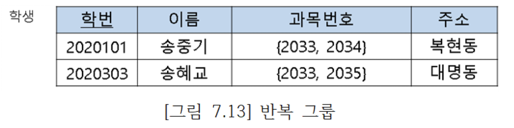
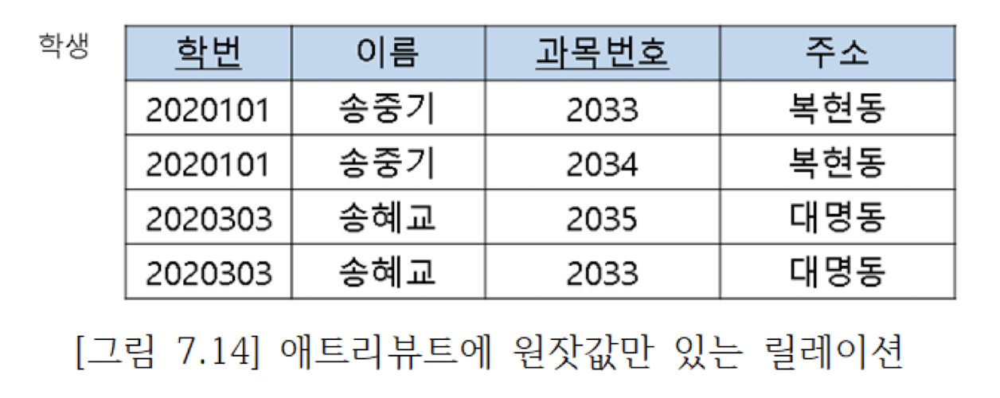
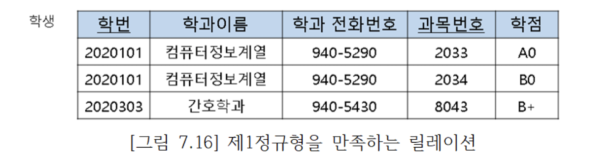
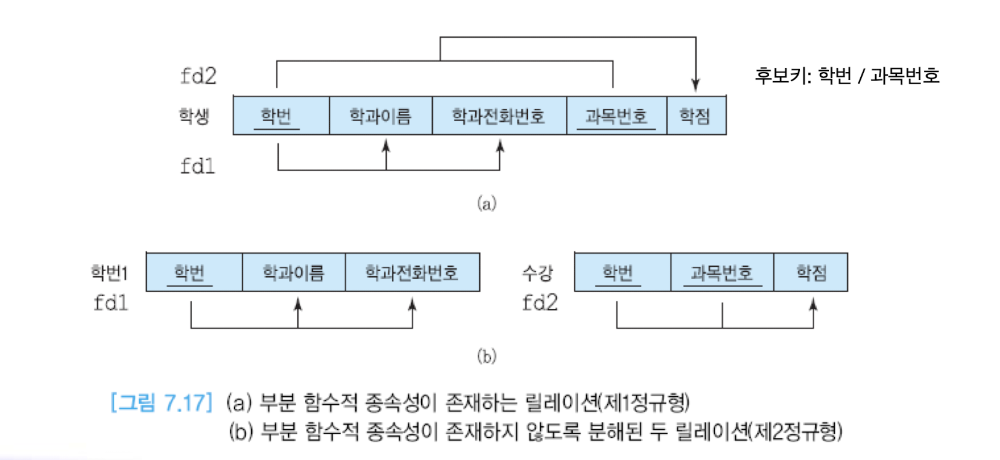
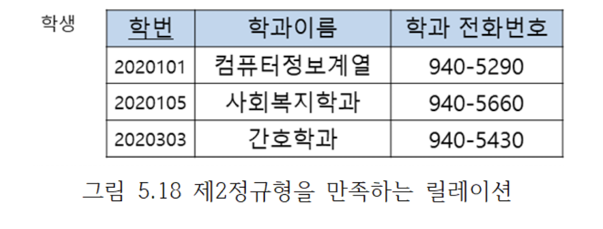
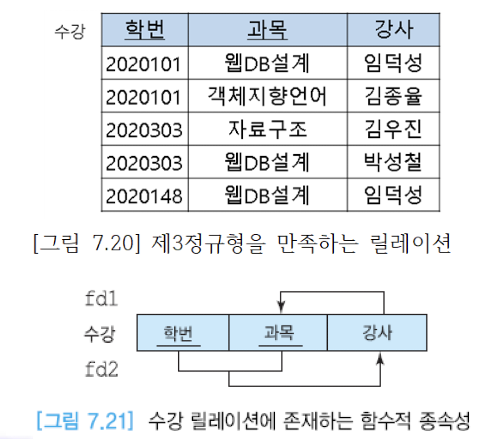

# 7장 릴레이션 정규화
* 릴레이션 정규화
  - 부주의한 데이터베이스 설계는 제어할 수 없는 데이터 중복을 야기하여 여러 가지 갱신이상을 유발
  - 어떻게 좋은 데이터베이스 설계를 할 것인가?
  - 데이터베이스에 어떤 릴레이션을 생성할 것인가?
  - 각릴레이션에 어떤 애트리뷰트들을 둘 것인가?
  - 정규화는 주어진 릴레이션 스키마를 함수적 종속성과 기본키를 기반으로 분석하여, 원래의 릴레이션을 분해함으로써 중복과세 가지 갱신이상을 최소화

* 좋은 관계 데이터베이스 스키마를 설계하는 목적
  - 정보의 중복과 갱신 이상이 생기지 않도록 하고, 정보의 손실을 막으며, 실 세계를 훌륭하게 나타내고, 애트리뷰트들 간의 관계가 잘 표현되는 것을 보장하며, 어떤 무결성 제약조건의 시행을 간단하게 하며, 아울러 효율성 측면도 고려하는 것
  - 먼저 갱신 이상이 발생하지 않도록 노력하고, 그 다음에 효율성을 고려함

* 갱신이상
  - 수정 이상
    - 반복된 데이터 중에 일부만 수정하면 데이터의 불일치가 발생
      예: 만일 어떤 부서의 이름이 바뀔 때 이 부서에 근무하는 일부 사원 투플에서만 부 서이름을 변경하면 데이터베이스가 불일치 상태에 빠짐
  - 삽입 이상
    - 불필요한 정보를 함께 저장하지 않고는 어떤 정보를 저장하는 것이 불가능
      예: 만일 어떤 부서를 신설했는데 아직 사원을 한 명도 배정하지 않았다면 이 부서에 관한 정보를 입력할 수 없음
  - 삭제 이상
    - 유용한 정보를 함께 삭제하지 않고는 어떤 정보를 삭제하는 것이 불가능
      예: 만일 어떤 부서에 속한 사원이 단 한 명이 있는데, 이 사원에 관한 투플을 삭제 하면 이 사원이 속한 부서에 관한 정보도 릴레이션에서 삭제됨

* 릴레이션의 분해
  - 하나의 릴레이션을 두 개 이상의 릴레이션으로 나누는 것
  - 릴레이션의 분해는 필요한 경우에는 분해된 릴레이션들로부터 원래의 릴레이션을 다시 구할 수 있음을 보장해야 한다는 원칙을 기반
  - 분해를 잘못하면 두 릴레이션으로부터 얻을 수 있는 정보가 원래의 릴레이션이 나타내던 정보보다 적을 수도 있고 많을 수도 있음
  - 릴레이션의 분해는 릴레이션에 존재하는 함수적 종속성에 관한 지식을 기반으로 함
  + join시 원래의 하나의 테이블과 같은 결과값이 나와야함!!

* 정규화의 종류 (일반적으로 '-'해당 기호의 단계까지 진행)
  - 제1정규형
  - 제2정규형
  - 제3정규형
  - BCNF
  + 제4정규형
  + 제5정규형

* 관계 데이터베이스 설계의 비공식적인 지침
  - 지침 1: 이해하기 쉽고 명확한 스키마를 만들라
    - 여러 엔티티 타입이나 관계 타입에 속한 애트리뷰트들을 하나의 릴레이션에 포함시키지 않음
  - 지침 2: 널값을 피하라
  - 지침 3: 가짜 투플이 생기지 않도록 하라
  - 지침 4: 스키마를 정제하라

* *함수적 종속성*의 개요
  - 정규화 이론의 핵심
  - 릴레이션의 애트리뷰트들의 의미로부터 결정됨
  - 릴레이션 스키마에 대한 주장이지, 릴레이션의 특정 인스턴스에 대한 주장이 아님
  - 릴레이션의 가능한 모든 인스턴스들이 만족해야 함
  - 실세계에 대한 지식과 응용의 의미를 기반으로 어떤 함수적 종속성들이 존재하는가를 파악해야 함
  - 함수적 종속성은 제2정규형부터 BCNF까지 적용됨 -> 그렇기에 함수적 종속성을 알아야함!!

* 결정자(determinant) - 슈퍼키와 비슷
  - 어떤 애트리뷰트의 값은 다른 애트리뷰트의 값을 고유하게 결정할 수 있음
  - 그림 7.4의 사원 릴레이션에서 사원번호는 사원이름을 고유하게 결정함 (이의 경우 사원번호가 *결정자*가 됨)
  - 주소는 사원이름을 고유하게 결정하지 못함
  - 결정자는 주어진 릴레이션에서 다른 애트리뷰트(또는 애트리뷰트들의 집합)를 고유하게 결정하는 하나 이상의 애트리뷰트를 의미
    + 기본키와 비슷하게 구성될 수 있음 BUT: 기본키와는 다름
  - 결정자를 아래와 같이 표기하고, 이를 “A가 B를 결정한다”(또는 “A는 B의 결정자이다”)라고 말함
    + 표기법: A -> B

* 함수적 종속성
  - 만일 애트리뷰트 A가 애트리뷰의 결정자이면 B가 A에 함수적으로 종속한다고 말함
  - 다른 말로 표현하면, 주어진 릴레이션 R에서 애트 B가 애트리뷰트 A에 함수적으로 종속하는 필요 충분 조건은 각 A 값에 대해 반드시 한 개의 B 값이 대응된다는 것
    - 예: 사원번호가 사원이름, 주소, 전화번호의 결정자이므로 사원이름, 주소, 전화번호는 사원번호에 함수적으로 종속
    - 예: 직책은 (사원번호, 부서번호)에 함수적으로 종속하지, 사원번호에 함수적으로 종속하지는 않음
      + 직책은 (사원번호, 부서번호) 쌍에 함수적으로 종속

* 완전 함수적 종속성(FFD: Full Functional Dependency)
  - 주어진 릴레이션 R에서 애트리뷰트 B가 애트리뷰트 A에 함수적으로 종속하면서 애트리뷰트 A의 어떠한 진부분 집합에도 함수적으로 종속하지 않으면 애트리뷰트 B가 애트리뷰트 A에 완전하게 함수적으로 종속한다고 말함
  - 여기서 애트리뷰트 A는 복합 애트리뷰트
    + 진부분 집합: 부분집합에서 자기자신을 제외한 집합
      : {A, B, C}에서 / 부분집합은 A, B, C, AB, AC, BC, ABC / 진부분집합은 A, B, C, AB, AC, BC
    + {사원번호, 부서번호} -> 직책의 경우 쌍으로 함수적으로 종속하며, 사원번호/부서번호에서 각각에서 함수적으로 종속하지 않을 경우. 완전 함수적 종속석

* 이행적 함수적 종속성(transitive FD)
  - 한 릴레이션의 애트리뷰트 A, B, C가 주어졌을 때 애트리뷰트 C가 이행적으로 A에 종속한다(A→C)는 것의 필요 충분 조건은 *A → B ∧ B → C* 가 성립하는 것
    + A가 B의 결정자이고, B가 C의 결정자이면, A는 C의 결정자이다.
    + B가 A에 함수적으로 종속하고, C가 B에 함수적으로 종속하면, C는 A에 함수적으로 종속한다.
  - A가 릴레이션의 기본 키라면 키의 정의에 따라 A→B와 A→C가 성립. 만일 C가 A외에 B에도 함수적으로 종속한다면 C는 A에 직접 함수적으로 종속하면서 B를 거쳐서 A에 이행적으로 종속

* 릴레이션 분해
  - 하나의 릴레이션을 두 개 이상의 릴레이션으로 나누는 것
  - 릴레이션을 분해하면 중복이 감소되고 갱신 이상이 줄어드는 장점이 있는 반면에, 바람직하지 않은 문제들을 포함하여 몇 가지 잠재적인 문제들을 야기할 수 있음
    - 릴레이션이 분해되기 전에는 조인이 필요 없는 질의가 분해 후에는 조인을 필요로 하는 질의로 바뀔 수 있음
    - 분해된 릴레이션들을 사용하여 원래 릴레이션을 재구성하지 못할 수 있음

* 무손실 분해
  - 분해된 두 릴레이션을 조인하면 원래의 릴레이션에 들어 있는 정보를 완전하게 얻을 수 있음
  - 여기서 손실이란 정보의 손실을 뜻함
  - 정보의 손실은 원래의 릴레이션을 분해한 후에 생성된 릴레이션들을 조인한 결과에 들어 있는 정보가 원래의 릴레이션에 들어 있는 정보보다 적거나 많은 것을 모두 포함

## 정규화
### 제1정규형
  - 한 릴레이션 R이 제1정규형을 만족할 필요 충분 조건은 릴레이션R의 모든 애트리뷰트가 원자값만을 갖는다는 것
  - 즉 릴레이션의 모든 애트리뷰트에 *반복 그룹*(repeating group)이 나타나지 않으면 제1정규형을 만족함
  
  1. 중복된 값을 하나의 투플로 표현 -> 
  

* 제 1정규형에서는 아래의 갱신이상이 생길 수 있음
  * 수정 이상
    - 한 학과에 소속한 학생 수만큼 그 학과의 전화번호가 중복되어 저장되므로 여러 학생이 소속된 학과의 전화번호가 변경되었을 때 그 학과에 속한 모든 학생들의 투플에서 전화번호를 수정하지 않으면 데이터베이스의 일관성이 유지되지 않음
  * 삽입 이상
    - 한 명의 학생이라도 어떤 학과에 소속되지 않으면 이 학과에 관한 투플을 삽입할 수 없음. 왜냐하면 학번이 기본 키의 구성요소인데 엔티티 무결성 제약조건에 따라 기본 키에 널값을 입력할 수 없기 때문
  * 삭제 이상
    - 어떤 학과에 소속된 마지막 학생 투플을 삭제하면 이 학생이 소속된 학과에 관한 정보도 삭제됨
* 갱신 이상이 생기는 이유
  - 기본 키에 대한 부분 함수적 종속성이 학생 릴레이션에 존재함

### 제2정규형 -> 제1정규형의 문제점을 해결하기 위해서 
  - 한 릴레이션 R이 제2정규형을 만족할 필요 충분 조건은 릴레이션 R이 제1정규형을 만족하면서,
    어떤 후보 키에도 속하지 않는 모든 애트리뷰트들이 R의 기본 키에 완전하게 함수적으로 종속하는 것 
  - 기본 키가 두 개 이상의 애트리뷰트로 구성되었을 경우에만 제1정규형이 제2정규형을 만족하는가를 고려할 필요가 있음
  -> 제1정규형 만족 / 기본키가 하나 -> 제2정규형 만족

* 제2정규형에 존재하는 갱신 이상 
  * 수정 이상
    - 여러 학생이 소속된 학과의 전화번호가 변경되었을 때 그 학과에 속한 모든 학생들의 투플에서 전화번호를 수정하지 않으면 데이터베이스의 일관성이 유지되지 않음
  * 삽입 이상
    - 어떤 학과를 신설해서 아직 소속 학생이 없으면 그 학과의 정보를 입력할 수 없다. 왜냐하면 학번이 기본 키인데 엔티티 무결성 제약조건에 따라 기 본 키에 널값을 입력할 수 없기 때문
  * 삭제 이상
    - 어떤 학과에서 마지막 학생의 투플이 삭제되면 그 학과의 전화번호도 함께 삭제됨
* 갱신이상이 생기는 이유: 학생 릴레이션에서 이행적 종속성이 존재하기 때문 

## 제3정규형
* 한 릴레이션 R이 제3정규형을 만족할 필요 충분 조건은 릴레이션 R이 제2정규형을 만족하면서, 키가 아닌 모든 애트리뷰트가 릴레이션 R의 기본 키에 이행적으로 종속하지 않는 것

* 제3정규형에 존재하는 갱신 이상 
  - 그림 7.20의 수강 릴레이션에서 각 학생은 여러 과목을 수강할 수 있고, 각 강사는 한 과목만 가르침. 이 릴레이션의 기본 키는 (학번, 과목)
  - 키가 아닌 강사 애트리뷰트가 기본 키에 완전하게 함수적으로 종속하므로 제2정규형을 만족하고, 키가 아닌 강사 애트리뷰트가 기본 키에 직접 종속하므로 제3정규형도 만족함
  - 이 릴레이션에는 아래와 같은 함수적 종속성들이 존재함 / (학번, 과목) → 강사 / 강사 → 과목

* 제3정규형의 갱신이상 발생
  * 수정 이상
    - 여러 학생이 수강 중인 어떤 과목의 강사가 변경되었을 때 그 과목을 수강하는 모든 학생들의 투플에서 강사를 수정하지 않으면 데이터베이스의 일관성이 유지되지 않 음
  * 삽입 이상
    - 어떤 과목을 신설하여 아직 수강하는 학생이 없으면 어떤 강사가 그 과목을 가르친다는 정보를 입력할 수 없음
      - 왜냐하면 학번이 기본 키를 구성하는 애트리뷰트인데 엔티티 무결성 제약조건에 따라 기본 키를 구성하는 애트리뷰트에 널값을 입력할 수 없기 때문
  * 삭제 이상
    - 어떤 과목을 이수하는 학생이 한 명밖에 없는데 이 학생의 투플을 삭제하면 그 과목을 가르치는 강사에 관한 정보도 함께 삭제됨

* 갱신 이상이 생기는 이유 
  - 수강 릴레이션에서 키가 아닌 애트리뷰트가 다른 애트리뷰트를 결정하기 때문
  - 이 릴레이션의 후보 키는 (학번, 과목)과 (학번, 강사)
    + 새로운 과목이 생성될 때 학생이 없기 때문에, 갱신이상 발생
    + 강사가 변경될 때 모든 학생에서 수정되지 않으면, 일관성이 깨짐
    + 과목을 이수하는 학생 정보가 삭제할 경우, 강사의 정보도 같이 삭제

## BCNF
  * 한 릴레이션 R이 BCNF를 만족할 필요 충분 조건은 릴레이션 R이 제3정규형을 만족하고, *모든 결정자가 후보 키*이어야 함
  * 위의 수강 릴레이션에서 강사 애트리뷰트는 후보 키가 아님에도 불구하고 과목 애트리뷰트를 결정하기 때문에 BCNF가 아님
  * 제3정규형을 만족하는 대부분의 릴레이션들은 BCNF도 만족함
  * 하나의 후보 키만을 가진 릴레이션이 제3정규형을 만족하면 동시에 BCNF도 만족함
  * 제3정규형을 만족하는 릴레이션을 BCNF으로 정규화하려면 *키가 아니면서 결정자 역할을 하는 애트리뷰트*와 그 결정자에 함수적으로 종속하는 애트리뷰트를 하나의 테이블에 넣음.
    이 릴레이션에서 결정자는 기본 키가 됨 // 강사 -> {과목, 강사}를 한 테이블로 생성함으로써 해결
  * 그 다음에는 기존 릴레이션에 결정자를 남겨서 기본 키의 구성요소가 되도록 함. 또한 이 결정자는 새로운 릴레이션에 대한 외래키 역할도 함
  -> 

* 정규형의 요약 

* 역정규화　=> 성능상의 문제로, 역으로 릴레이션을 다시 합치는 작업!!
  - 정규화 단계가 진행될수록 중복이 감소하고 갱신 이상도 감소됨
  - 정규화가 진전될수록 무결성 제약조건을 시행하기 위해 필요한 코드의 양도 감소됨
  - 정규화가 데이터베이스 설계의 중요한 요소이지만 성능상의 관점에서만 보면 높은 정규형을 만족하는 릴레이션 스키마가 최적인 것은 아님 **중요**(join -> 쿼리비용이 증가)
  - 한 정규형에서 다음 정규형으로 진행될 때마다 하나의 릴레이션이 최소한 두 개의 릴레이션으로 분해됨
  - 분해되기 전의 릴레이션을 대상으로 질의를 할 때는 조인이 필요 없지만 분해된 릴레이션을 대상으로 질의를 할 때는 같은 정보를 얻기 위해서 보다 많은 릴레이션들을 접근해야 하므로 조인의 필요성이 증가함
  - 때로 데이터베이스 설계자는 응용의 요구 사항에 따라 데이터베이스 설계의 일부분을 역정규화함으로써 데이터 중복 및 갱신 이상을 대가로 치르면서 성능상의 요구를 만족시키기도 함
  - 많은 데이터베이스 응용에서 검색 질의의 비율이 갱신 질의의 비율보다 훨씬 높음. 역정규화는 주어진 응용에서 빈번하게 수행되는 검색 질의들의 수 행 속도를 높이기 위해서 이미 분해된 두 개 이상의 릴레이션들을 합쳐서 하나의 릴레이션으로 만드는 작업
  - 즉 역정규화는 보다 낮은 정규형으로 되돌아가는 것
  - 
