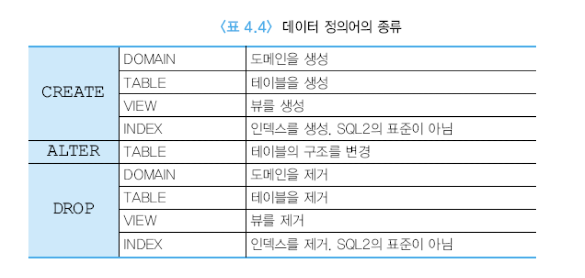

# 관계 대수와 SQL
* SQL 개요
  - SQL은 현재 DBMS 시장에서 관계 DBMS가 압도적인 우위를 차지하는데 중요한 요인의 하나
  - SQL은 IBM 연구소에서 1974년에 System R이라는 관계 DBMS 시제품을 연구할 때 관계 대수와 관계 해석을 기반으로, 집단 함수, 그룹화, 갱신 연 산 등을 추가하여 개발된 언어
  - 1986년에 ANSI(미국 표준 기구)에서 SQL 표준을 채택함으로써 SQL이 널 리 사용되는데 기여
  - 다양한 상용 관계 DBMS마다 지원하는 SQL 기능에 다소 차이가 있음
  - 본 책에서는 SQL2를 따름
  - SQL은 비절차적 언어(선언적 언어)이므로 사용자는 자신이 원하는 바(what)만 명시하며, 원하는 것을 처리하는 방법(how)은 명시할 수 없음
  - 관계 DBMS는 사용자가 입력한 SQL문을 번역하여 사용자가 요구한 데이터를 찾는데 필요한 모든 과정을 담당
  - 자연어에 가까운 구문을 사용하여 질의를 표현할 수 있음
  - 두 가지 인터페이스
    - 대화식 SQL(interactive SQL)
    - 내포된 SQL(embedded SQL)

* 오라클 SQL의 구성요소
  - 데이터 검색
  - 데이터 조작어
  - 데이터 정의어
    - 트랜잭션 제어
    - 데이터 제어어

* 데이터 정의어
  - 스키마의 생성과 제거
    - SQL2에서는 동일한 데이터베이스 응용에 속하는 릴레이션, 도메인, 제약조건, 뷰, 권한 등을 그룹화하기 위해서 스키마 개념을 지원
* 릴레이션 제거
  - DROP TABLE DEPARTMENT;
* ALTER TABLE
  - ALTER TABLE EMPLOYEE ADD PHONE CHAR(13);
* 인덱스 생성
  - CREATE INDEX EMPDNO_IDX ON EMPLOYEE(DNO);

* 참조 무결성 제약조건 유지
  - ON DELETE NO ACTION
    - 삭제가 되지 않게
  - ON DELETE CASCADE
    - 같이 삭제
  - ON DELETE SET NULL
    - null로 수정
  - ON DELETE SET DEFAULT
    - default 값으로 변경
  - ON UPDATE NO ACTION

* SELECT문
  - 관계 데이터베이스에서 정보를 검색하는 SQL문
  - 관계 대수의 실렉션과 의미가 완전히 다름
  - 관계 대수의 실렉션, 프로젝션, 조인, 카티션 곱 등을 결합한 것
  - 관계 데이터베이스에서 가장 자주 사용됨
  - 여러 가지 질의들의 결과를 보이기 위해서 그림 4.8의 관계 데이터베이스 상태를 사용함
