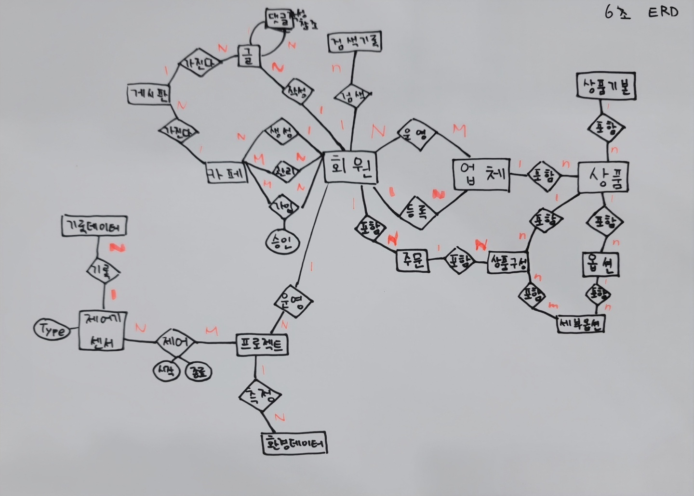

# 알아야할 개념
* DB-index: 트리
  - 이진트리: 중간에 있는 포인트를 이용해, 검색 범위를 반으로 줄이는 작업
    - 순차적으로 진행할 경우: 평균 50만번
    - 이진트리의 경우: 100만개 -> 50만개 -> 25만개 ... : 로그 n번을 n번으로 검색 -> 20번
    => 검색시간을 획기적으로 줄일 수 있음! 

## DB 설계_회원
* 회원관리 -> defalut값이므로 기능에 넣을 수 없다.
  -> 회원관리를 더 세부적으로 요구되는 사항을 ERD를 다시 그려볼 것

## 타 서비스와의 차별점
* 잘 사용되고 있지 않은 서비스들에서도 어떠한 문제점이 있어서, 사용되지 않는지 / 개발한 서비스는 어떻게 개선을 하여, 많은 유저들이 사용할 수 있도록 했는지
* 가능한 찾아보는 것이 좋음

## 서비스 필요성
* 기존 서비스의 문제점을 찾음 -> 우리는 ~~해서 이러한 서비스를 만들 필요성이 있었다

## 주요서비스
* 주요서비스에서는 주요 서비스의 이름!!(프로젝트명과는 다름!!)

## ERD 
* 엔티티, 어트리뷰트, 관계 -> 상세하게 보면 좋음 -> A3용지에 그리는 것이 좋음
* 엔티티, 관계 -> 이 두가지만 보이게 -> 보기가 편리함!!
  -> 엔티티와 관계가 이상하다면, 어트리뷰트까지 같이 보며, 수정해 나갈 수 있음

# 쇼핑몰

* [상품] - <포함> - [상품기본]
  - 다른 업체가 같은 상품을 올릴 경우: 가격 등은 달라질 수 있지만, 기본 사진, 기본 음식 정보는 바뀌지않으므로, 구분을 하는 것, -> 6조의 경우 식물이 크는 것은 매번 달라짐으로, 상황에 따라 사용하는 것이 중요

