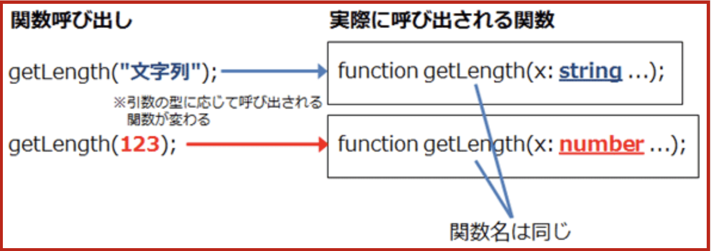

# 함수

## 함수정의
```javascript
// function signature: function header
function 함수명(parameter)　{ // funciton body
  [실행문;] // 생략가능
  [return value;] // 생략 시 return undefined 기본적으로 실행됨
}
```
1. 関数宣言を使う方法 : 함수선언을 이용하는 방법
```typescript
function 함수명(파라미터1: 데이터타입, 파라미터2: 데이터타입/* 파라미터는 생략가능 */): 반환값데이터타입 {
  실행문장들; // 생략가능
  return 값;
}
```
    // （1）
  - 仮引数（かりひきすう）のリスト: list of parameters（パラメーター）

2. 関数式を使う方法 : 함수식을 이용하는 방법
```typescript
const 함수명(함수를 참조하는 변수명) = function (파라미터1: 데이터타입, 파라미터2: 데이터타입/* 파라미터는 생략가능 */): 반환값데이터타입 {
  실행문장들; // 생략가능
  return 값;
}
```
```typescript
/* 잘못된 형태 */
var add2: function = function(x: number, y: number): number {
  return x + y;
};// error 발생

/* 이렇게도 가능함 */
var add2: (x: number, y: number) => number = function (x: number, y: number): number {
  return x + y;
}; // error 없이 실행가능!!
```


3. アロー関数式を使う方法 : 화살표함수를 이용하는 방법
```typescript
const 함수명(함수를 참조하는 변수명) = (파라미터1: 데이터타입, 파라미터2: 데이터타입/* 파라미터는 생략가능 */): 반환값데이터타입  => {
  실행문장들; // 생략가능
  return 값;
}
```

## 함수호출 -> 함수 정의 후 호출(함수 사용)
- 함수명(argument: アーギュメンド); 
- 함수명(list of parameters)
  - 실인수리스트

## 함수 반환값 : 반환값 데이터 타입 지정
  - return 반환값;
  - 하나의 함수에서 여러개의 반환값을 반환하도록 하는 방법
    + 함수의 반환값이 여려개인 언어: C#, GO, ..
    - 반환치으로 객체를 지정
    - JSON 반환

# 함수관련 토픽


## 옵션 인수(オプションの引数)
* 생략 가능한 가인수 정의
* 인수명 뒤에 ?
* 생략 가능한 인수는 파라미터 리스트의 *맨 마지막*에 작성해야함(제약조건)
  - 파라미터의 중간에 넣을 경우 에러 발생..
* ? 없이 옵션인수 지정하려면 디폴트 값을 지정

```typescript
// **옵션 인수 예제**
const calcCost = (price: number, amount: number, discount?: number): number => {
// price, amount: required parameters
// discount? : optional parameter: last position
  if (discount) {
    return price * amount * (1 - discount);
  } else {
    return price * amount;
  }
};
alert(calcCost(1200, 10)); // 12000 출력
alert(calcCost(1200, 10, 0.2)); // 9600 출력(20% 할인 적용)
```

```typescript
// **옵션 인수 예제**
const calcCost = (price: number, amount: number, discount = 0): number => {
// price, amount: required parameters
// discount = 0 : optional parameter: default value assingnment
  if (discount != 0) {
    return price * amount * (1 - discount);
  } else {
    return price * amount;
  }
};
alert(calcCost(1200, 10)); // 12000 출력
alert(calcCost(1200, 10, 0.2)); // 9600 출력(20% 할인 적용)
```
## 가변길이 인수: 可変長引数
* 인수의 길이가 변할 수 있는 인수
* 인수명 앞에 ... 생략부호 입력
* 파라미터리스트의 맨 마지막에 작성
* 타입[]형태로 Type을 지정

```typescript
// 가변길이 인수 예제
const paramtest = (arg1: number, ...restparam: number[]) => {
  return  'reqired param: ' + arg1 + 
          "\nfirst item of restparam: " + restparam[0] +
         "\nlength of restparam: " + restparam.length;
}
alert(paramtest(1, 2, 3, 4, 5));
reqired param: 1 
first item of restparam: 2
length of restparam: 4;
```
```typescript
// 가변길이 인수 예제
const paramtest = (arg1: number, arg2 = 123, ...restparam: number[]) => {
  return  'reqired param: ' + arg1 + 
          '\nnaptional param: ' + arg2 + 
          "\nfirst item of restparam: " + restparam[0] +
          "\nlength of restparam: " + restparam.length;
}
alert(paramtest(1, 2, 3, 4, 5));
// reqired param: 1
// naptional param: 2 
// first item of restparam: 3
// length of restparam: 3;

// alert(paramtest(1, , 3, 4, 5)); // err

alert(paramtest(1, undefined, 3, 4, 5));
// reqired param: 1
// naptional param: 123
// first item of restparam: 3
// length of restparam: 3;
```

## Function Overload: 関数のオーバーロード
* Overload(오버로드): function header에서 함수명은 같고, 인수 리스트가 다르거나, 반환값 타입이 다른 경우
  

```typescript
// 예제: 타입스크립트와 자바스크립트에서는 err발생, 구현 형태의 에시
function getLength(x: string): number {
    return x.length;
}
function getLength(x: number): number {
    if (x == 0) return 1;
  return Math.floor(Math.log(x) / Math.LN10) + 1; // 정수의 자릿수를 계산하는 공식
}
alert(getLength(123));
```


```typescript
function getLength(x: number): number;   // （1） function headers
function getLength(x: string): number;   // （2） function headers
function getLength(x: any): number {     // （3） function headers + body
  if (typeof (x) == "string") {
    return x.length
  } else {
    if (x == 0) return 1;
    return Math.floor(Math.log(x) / Math.LN10) + 1;   // （4）
  }
}
alert(getLength(123)); // (3) (any형)함수 실행
//  결과값: 3
alert(getLength('123')); // (2) (string형)함수실행
```

```typescript
function getLength(x: number): number;
function getLength(x: string, isCharUnit: boolean): number;   // （1）
function getLength(x: any, isCharUnit = true): number {   // （2）
  if (typeof (x) == "string") {
    if (isCharUnit) {
      return x.length;
    } else {   // （3）
      var sum = 0;
      for (var i = 0; i < x.length; i++) {
        if (x.charCodeAt(i) < 256) {
          sum += 1;
        } else {
          sum += 2;
        }
      }
      return sum;
    }
  } else {
    if (x == 0) return 1;
    return Math.floor(Math.log(x) / Math.LN10) + 1;
  }
}

alert(getLength("abc日本語", false));
// 출력: 9
alert(getLength("abc日本語", true));
// 출력: 6
alert(getLength("abc日本語가나다", false));
// 출력: 15
alert(getLength("abc日本語가나다", true));
// 출력: 9
```

* 중첩 if문 줄이기
  1. 공통코드는 모든 블록내로 삽입
  2. else와 if문 중 짧은 코드를 먼저 작성
    - 조건식이 !으로 변경할 수 있음
  3. return
  4. 1~3 반복
```typescript
// 중첩 if문 줄이기 예제
function getLength(x: number): number;
function getLength(x: string, isCharUnit: boolean): number;   // （1）
function getLength(x: any, isCharUnit = true): number {   // （2）
  if(typeof (x) != "string"){
    if (x == 0) return 1;
    return Math.floor(Math.log(x) / Math.LN10) + 1;
  }
  
  if (isCharUnit) {
    return x.length;
  } else {   // （3）
    var sum = 0;
    for (var i = 0; i < x.length; i++) {
      if (x.charCodeAt(i) < 256) {
        sum += 1;
      } else {
        sum += 2;
      }
    }
    return sum;
  }
}

alert(getLength("abc日本語", false));
```

## Generics: ジェネリックス, 総称型(そうしょうかた)
* 임시 사용자 정의 데이터 타입명으로 지정
* 데이터 타입의 확정: 함수 호출 시 아규먼트지정으로 확정
* 데이터 타입의 위치만 가짜로 지정해 두고, 실제로는 호출 시 데이터 타입 결정
* 선언:
  - function 함수명<list of Generics>(param1: Generics Symbol, param2: Generics Symbol, ...): 반환형{}
* 호출:
  - 함수명<테이터타입리스트>
```typescript
// 대표적인 예제
function parrot<T>(data: T): T {  // （1）
  var ret: T; // （2）
  ret = data;
  return ret;
}
alert(parrot<number>(100));
alert(parrot<string>("abc"));
// alert(parrot<string>(123));    // データ型が合わないのでこれはエラーとなる = string 타입인데 숫자형임으로 에러 발생
```

```typescript
/* 
// err 발생
function getLength<T, U>(x: T): U { // （1）
  return x.length;  // （3） T에 length 속성이 미정의 -> err 발생
} 
*/

interface PROP {
  length: any;  // （1）
}
function getLength<T extends PROP, U>(x: T): U {  // （2）
  return x.length;
}
alert(getLength<string, number>("総称型"));  // （2）
// 출력: 3
```

```typescript
// 자료구조 학습 중 원형 큐
// circular queue : 원형큐 -> 리볼버 총
// OS구현 중 나오는 개념

// data: T[]의 제너릭으로 구현을 할 경우: string, number 등등 여러 타입을 받을 수 있음!!
function getCircleArray<T>(data: T[], idx: number): T {
  var index: number;
  index = idx % data.length;  // （1） index: 0 ~ data.length -1 -> 배열의 idx값까지만 나옴으로 err 사전 방지
  // 배열의 길이를 나머지 값으로
  return data[index];
}
var a = [10, 20, 30, 40];
var dir = ["N", "E", "S", "W"];
alert(getCircleArray<number>(a, 5));  // （2）
// javascript의 지식으로는 undefined
// 출력: 20
alert(getCircleArray<string>(dir, 5));  // （3）
// 출력: E
alert(getCircleArray<number>(a, 100));
// 출력: 10
alert(getCircleArray<string>(dir, 100));
// 출력: N
```


## Clousure: 클로저, クロージャー
* 함수가 정의된 환경(외부함수)의 변수를 이용할 수 있는 기능
  - 関数が定義された環境にある変数を利用できる機能
* private변수 처리
* 사용하는 곳:
  - クロージャーは、イベントハンドラーがそのコンテキスト（環境）に関するデータにアクセスするときなど、さまざまな場面で使われているが、なかなか理解しづらい考え方である。

```typescript
function getSerialNumber() { // high order function, 고차함수(함수를 리턴)
  var origin = 0;  // （1） // private 변수를 활용할 때 (5, 6)처럼 접근하여 사용가능
  function countUp(delta: number): number {  // （2）
    return origin += delta;
  }
  return countUp; // （3） 함수 반환
};
var inside = getSerialNumber(); // （4） inside == countUp
alert(inside(2)); // （5）
// 출력: 2
alert(inside(3)); // （6）
// 출력: 5

const testClosure = (() => {
  let outerVar = 0;
  return (dalta: number) => {
    return (outerVar+= delta);
  }
})(); // 이름없는 함수를 정의하면서 호출하는 예제 (= 익명함수)
alert(testClosure(4)); // （5）
// 출력: 4
alert(testClosure(7)); // （6）
// 출력: 11
```

```typescript
// const f1 = (i: number) => (j: number) => (k: number) => i*j+k
// i = 3 / j = 2 / k = 6
const f1 = (i: number) => (j: number) => (k: number) => i-- * ++j % k // 출력: 3
// i = 3 / j = 3 / k = 6
// -> 9 % 6
// -> 3
const f2 = f1(3);
const f3 = f2(2);
alert(f3(6));
// 출력: 12
```
