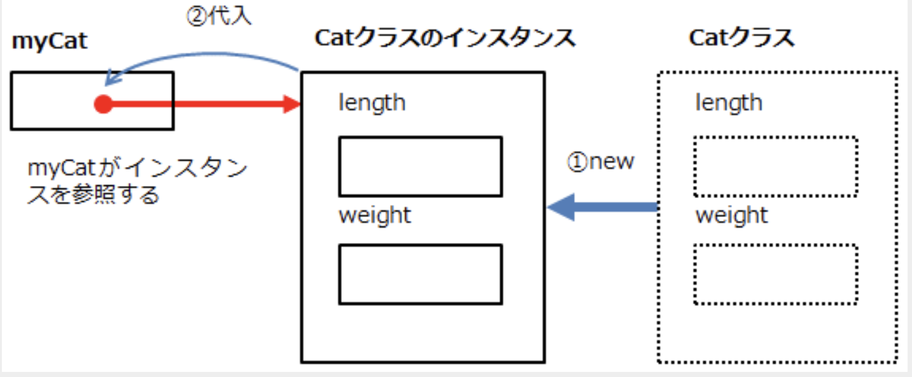

# 객체, object, オブジェクト
* 실세계에 존재하는 여러가지 물건 / 일
  - 예: 고양이, 개, 소, 돼지
  - 구성요소: 멤버
    - 속성: property
      - 특징: 해당 객체를 구별할 수 있는 구체적인 특성
        - length, weight, name, ...
    - 작용: behavior
      - 동작/작동/행동, 다른 객체에게 영향을 끼칠 수 있음
        - walk(), run(), meow(), eat()
* 객체의 생성 (javascript에서)
  - new Object()
  - {}
  - 클래스 정의: new연산
    - 자바스크립트, 타입스크립트에서 사용

```javascript
// let myCat = new Object(); // Object의 property에 length와 weight가 없음으로, typescript에서는 에러 발생
let myCat = {}; 
myCat.length = 45.0; // 
myCat.weight = 4.0;  // JS에서의 정의
```

# 클래스, class, クラス
* 객체의 표준형태(オブジェクトのひな型): 메일의 ひな形 : テンプレート template
* 실체: instance, 인스턴스, インスタンス
  - 클래스로부터 생성되는 구체적인 실체 (개별 객체)

```typescript
class 클래스명 {
  한정자 property명1: type,
  한정자 property명2: type,
  ...
  한정자 behavior명1(){}, // 메서드
  한정자 behavior명2(){},
  ...
}
// 한정자: 
// - private
// - public - default: 생략가능
// - protected(?) : 본적은 없음
```

* 타입스크립트의 객체 생성
```typescript
// 1. 클래스 정의
// 2. 객체 생성: new

class Cat { // (1)
    length: number;
    weight: number;
}

let myCat = new Cat(); // (2)
myCat.length = 45.0
myCat.weight = 4.0
console.log(myCat);
```
// 위 내용 확장
```typescript
// 1. 클래스 정의
// 2. 객체 생성: new

class Cat { // (1)
    length: number;
    weight: number;
    meow(): String {
        return 'にゃーん';
    }
    eat() {
        this.length += 0.1
        this.weight += 0.1
        return '밥을'
    }
}

let myCat = new Cat(); // (2)
myCat.length = 45.0
myCat.weight = 4.0

// 1 .연산자 사용
// const msg = `고양이는 ${myCat.meow()} 이라고 울고, 키는 ${myCat.length}CM 입니다.`
// 2 연관배열 사용
const msg = `고양이는 ${myCat['meow']} 이라고 울고, ${myCat['eat']()} 먹고나면, 키는 ${myCat.length}CM 입니다.`

// console.log(myCat);
console.log(msg);
```



  - mycat -> 스택에 생김
  - 인스턴스 -> 힙에 생김
    => 영역이 달라서, 참조해서 접근해야함 -> 거의 모든 언어(객체지향언어가 아님, c++ 등)에서 이렇게 진행됨

* 클래스에서 객체 생성: instance
  - new 클래스명()
    - 클래스명(): 생성자 호출

* 클래스의 맴버의 사용: property, behavior(method)
  - . 연산자 사용
    - 인스턴스명.property명1, 인스턴스명.behavior명1(아규먼트리스트),
  - 연관배열(연산배열) - 문자열로 접근 -> 변수로 처리 가능!!!!
    - 인스턴스명['property명1']
    - 인스턴스명['behavior명1'](아규먼트리스트)


```typescript
class Cat {
    length: number;
    weight: number;
    meow(): String {}
    meow(s: String): stirng {}
    meow(s?:any): String {}
    meow(): String {
      if(typeof(s) == 'string'){
          return s
        } else{
          return 'にゃーん';
        }
    }
    eat() {
        this.length += 0.1
        this.weight += 0.1
        return '밥을'
    }
}

let myCat = new Cat(); // (2)
myCat.length = 45.0
myCat.weight = 4.0

// 1 .연산자 사용
// const msg = `고양이는 ${myCat.meow()} 이라고 울고, 키는 ${myCat.length}CM 입니다.`
// 2 연관배열 사용
const msg = `고양이는 ${myCat['meow']} 이라고 울고, ${myCat['eat']('test')} 먹고나면, 키는 ${myCat.length}CM 입니다.`
console.log(myCat['eat']('test')); // 출력: test
console.log(myCat['eat']()); // 출력: にゃーん
console.log(msg);
```

* 특수한 메서드: 생성자, constructor
  - 메서드명: constructor로 고정
  - **오버로드 가능**
  - 호출: 클래스명(아규먼트리스트)

```typescript
class Cat {
    length: number;
    weight: number;
    name: string;
    constructor();
    constructor(s:string);
    constructor(s?: any) {
      if (typeof(s) == 'string') {
        this.name = s;
      } else {
        this.name = '이름없는 고양이';
      }
    }
    meow(): String {}
    meow(s: String): stirng {}
    meow(s?:any): String {}
    meow(): String {
      if(typeof(s) == 'string'){
          return s
        } else{
          return 'にゃーん';
        }
    }
    eat() {
        this.length += 0.1
        this.weight += 0.1
        return '밥을'
    }
}

let myCat = new Cat(); // (2)
let myCat1 = new Cat('일본IT'); // (2)
myCat.length = 45.0
myCat.weight = 4.0
myCat1.length = 45.0
myCat1.weight = 4.0

// 1 .연산자 사용
// const msg = `고양이는 ${myCat.meow()} 이라고 울고, 키는 ${myCat.length}CM 입니다.`
// 2 연관배열 사용
const msg = `고양이의 이름: ${myCat.name}, 울음소리: ${myCat['meow']}, ${myCat['eat']('test')}, 키: ${myCat.length}CM, 몸무게: ${myCat.weight}.`
const msg1 = `고양이의 이름은 ${myCat1.name}이고, ${myCat1['meow']} 이라고 울고, ${myCat1['eat']('test')} 먹고나면, 키는 ${myCat1.length}CM가 됩니다.`
console.log(myCat['eat']('test')); // 출력: test
console.log(myCat['eat']()); // 출력: にゃーん
console.log(msg, msg1);
```

* 오버라이드, override, 재정의
  - 조건: 상속관계가 성립되어야함

* 접근한정자
  - private
    - 은폐, 정보은닉 - information hiding
      - private 멤버에 접근하기 위해서는 public의 setter/getter 필요
  - public 
    - 디폴트로 지정되는 한정자
    - 누구나 사용가능
```typescript
class Cat {
    length: number;
    weight: number;
    private name: string;
    constructor();
    constructor(s:string);
    constructor(s?: any) {
      if (typeof(s) == 'string') {
        this.name = s;
      } else {
        this.name = '이름없는 고양이';
      }
    }

    setName(inputName: string) {
      this.name = inputName.slice(0, 8);
      // slice(start_idx, length): 문자열의 idx가 0~7까지의 문자열로 잘라내어 저장
    }
    getName(): string {
      return this.name
    }

    meow(): String {}
    meow(s: String): stirng {}
    meow(s?:any): String {}
    meow(): String {
      if(typeof(s) == 'string'){
          return s
        } else{
          return 'にゃーん';
        }
    }
    eat() {
        this.length += 0.1
        this.weight += 0.1
        return '밥을'
    }
}

let myCat = new Cat(); // (2)
let myCat1 = new Cat('일본IT'); // (2)
myCat.length = 45.0
myCat.weight = 4.0
myCat1.length = 45.0
myCat1.weight = 4.0

// 1 .연산자 사용
// const msg = `고양이는 ${myCat.meow()} 이라고 울고, 키는 ${myCat.length}CM 입니다.`
// 2 연관배열 사용
const msg = `고양이의 이름: ${myCat.getName()}, 울음소리: ${myCat['meow']}, ${myCat['eat']('test')}, 키: ${myCat.length}CM, 몸무게: ${myCat.weight}.`

myCat1.setName('흰동이');

const msg1 = `고양이의 이름은 ${myCat1.getName()}이고, ${myCat1['meow']} 이라고 울고, ${myCat1['eat']('test')} 먹고나면, 키는 ${myCat1.length}CM가 됩니다.`
console.log(myCat['eat']('test')); // 출력: test
console.log(myCat['eat']()); // 출력: にゃーん
console.log(msg, msg1);
```

* 상속: extends, 継承(= 계승)
  - 부모클래스-자식클래스, 슈퍼클래스-서브클래스, 상위클래스-하위클래스, 기저클래스-파생클래스(派生　は・せい)
  - parent-child, super-sub, upper-lower, base-derived

* 오버로드, overload, 중복정의
  - 조건: 같은 클래스 내
  - 함수의 오버로드와 동일한 문법 

```typescript
class 자식클래스명 extends 부모클래스명 {
}
//
class Cat {
  private name: string;
  public setName(s: string) {
    this.name = s.slice(0, 8);
  }
  public getName(): string {
    return this.name;
  }
  public meow(): string {
    return "にゃーん";
  }
}

class Tiger extends Cat {  // （1）
  public meow(): string {  // （2） // override
    return "がおー";
  }
}

var myTiger = new Tiger();  // （3）
myTiger.setName("とらお");  // （4）
alert("私の虎の名前は" + myTiger.getName() + "で、" + myTiger.meow() + "と鳴きます");  // （5）
```

* 부모 클래스의 멤버 접근
  - super
  - this: 자신의 클래스 멤버 접근을 위해 사용
